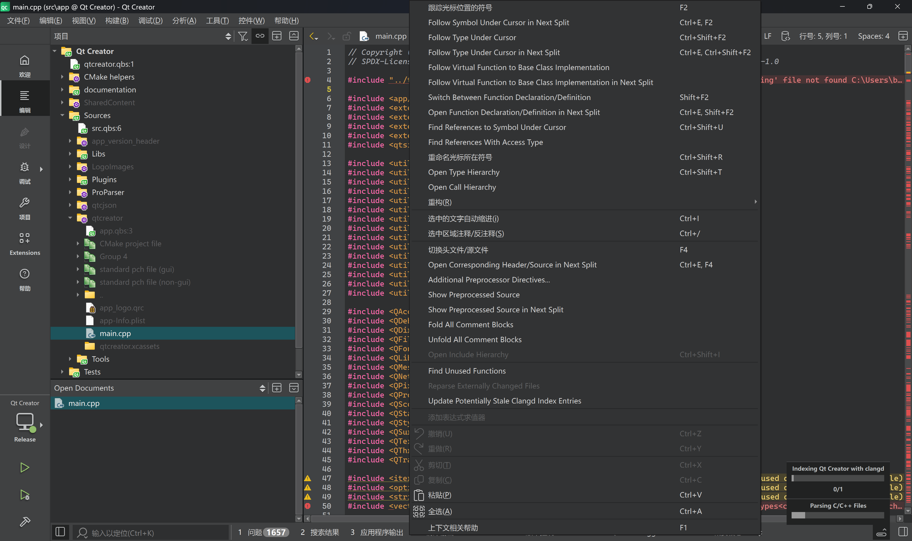
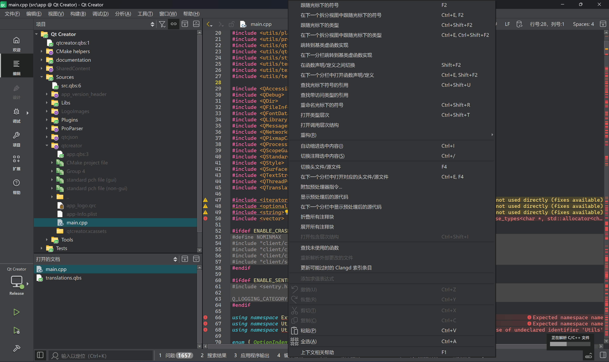

# Qt Creator 简体中文汉化补全

这是一个针对 **新版 Qt Creator** 的第三方简体中文翻译补充项目。

由于官方发行包自带的翻译文件 `qtcreator_zh_CN.ts` 存在覆盖率不足和大幅滞后于代码的问题，导致新版本中大量功能界面仍显示为英文。本项目旨在补全这部分缺失的文本，提供覆盖更全的中文界面体验。

**当前进度：**
* ✅ **官方部分**：已完成 Qt Creator 18.0 官方发行包中翻译文件的完整汉化。
* 🚧 **补全部分**：正在补全从最新源码 `lupdate` 提取出的缺失条目。

## 🖼️ 效果对比

| Official | Patched |
| :---: | :---: |
|  |  |

## ⚙️ 翻译说明

本项目非 Qt 官方维护。翻译工作主要由 **Antigravity + Google Gemini 3 Pro** 完成，并辅以人工校对。

鉴于项目中包含大量未校对的机器翻译，本项目仅作为社区补丁维护，旨在让开发者尽早体验高覆盖率的中文界面，**不会**向 Qt 官方仓库提交合并请求。

## 📥 使用方法

1.  在本项目 Release 页面或根目录下载 `qtcreator_zh_CN.qm` 文件。
2.  替换 Qt Creator 安装目录下的同名文件：
    * **Windows**: `Qt安装路径\Tools\QtCreator\share\qtcreator\translations`
    * **macOS**: `Qt Creator.app/Contents/Resources/translations`
    * **Linux**: `Basedir/share/qtcreator/translations`
3.  建议先备份原文件，替换后重启 Qt Creator 即可生效。

## 📂 文件结构

* `qtcreator_zh_CN.ts`: 正在维护的主翻译源文件。
* `qtcreator_zh_CN.qm`: 编译后的发布文件。
* `archive/`: 存放历史参考版本（如官方原版、未翻译的源码提取版等）。

---
*欢迎提交 Issue 反馈。*